## User guide

### Administration

#### Manage analyzer template
Energy SOAR will display the analysis summary the same way for all analyzers: display a tag using taxonomies and level color.

##### List analyzer templates
The management page can be accessed from the header menu under Admin organization > Analyzer templates and requires the manageAnalyzerTemplate permission (see Profiles and Permissions).


Analyzer templates are still customisable via the UI and can also be imported.

#### User Profiles management

##### Permissions
A Profile is a set of permissions attached to a User and an Organisation. It defines what the user can do on an object hold by the organisation. Energy SOAR has a finite list of permissions:

- manageOrganisation (1) : the user can create, update an organisation
- manageConfig (1): the user can update configuration
- manageProfile (1): the user can create, update and delete profiles
- manageTag (1): the user can create, update and delete tags
- manageCustomField (1): the user can create, update and delete custom fields
- manageCase: the user can create, update and delete cases
- manageObservable: the user can create, update and delete observables
- manageAlert: the user can create, update and import alerts
- manageUser: the user can create, update and delete users
- manageCaseTemplate: the user can create, update and delete case template
- manageTask: the user can create, update and delete tasks
- manageShare: the user can share case, task and observable with other organisation
- manageAnalyse (2): the user can execute analyse
- manageAction (2): the user can execute actions
- manageAnalyzerTemplate (2): the user can create, update and delete analyzer template (previously named report template)
- manageWorkflows: the user can create, update and delete workflows
- listWorkflows: the user can see a list of workflows
- viewWorkflows: the user can see workflow details
- manageReports: the user can create, update and delete reports
- listReports: the user can see a list of reports

(1) Organisations, configuration, profiles and tags are global objects. The related permissions are effective only on “admin” organisation. (2) Actions, analysis and template is available only if Energy SOAR Automation connector is enabled

**NOTE**

**Read** information doesn’t require specific permission. By default, users in an organisation can see all data shared with that organisation (cf. shares, discussed in Organisations,Users and sharing).

##### Profiles
We distinguish two types of profiles:

- Administration Profiles
- Organisation Profiles

The management page is accessible from the header menu through the Admin > Profiles menu and required a use with the manageProfile permission (refer to the section above).

Energy SOAR comes with default profiles but they can be updated and removed (if not used). New profiles can be created.


Once the New Profile button is clicked, a dialog is opened asking for the profile type, a name for the profile and a selection of permissions. Multiple selection can be made using CTRL+click.


If it is used, a profile can’t be remove but can be updated.

Default profiles are:

- admin: can manage all global objects and users. Can’t create case.
- analyst: can manage cases and other related objects (observables, tasks, …), including shring them
- org-admin: all permissions except those related to global objects
- read-only: no permission


#### Kill user session
Everytime you can manage logged user sessions as admin user. In organizations administration page you can kill user session. This user will be immediatelly logout.

Select user organization
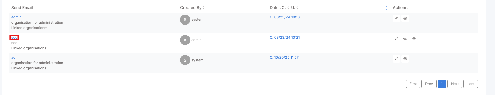

And click "Kill session" button.
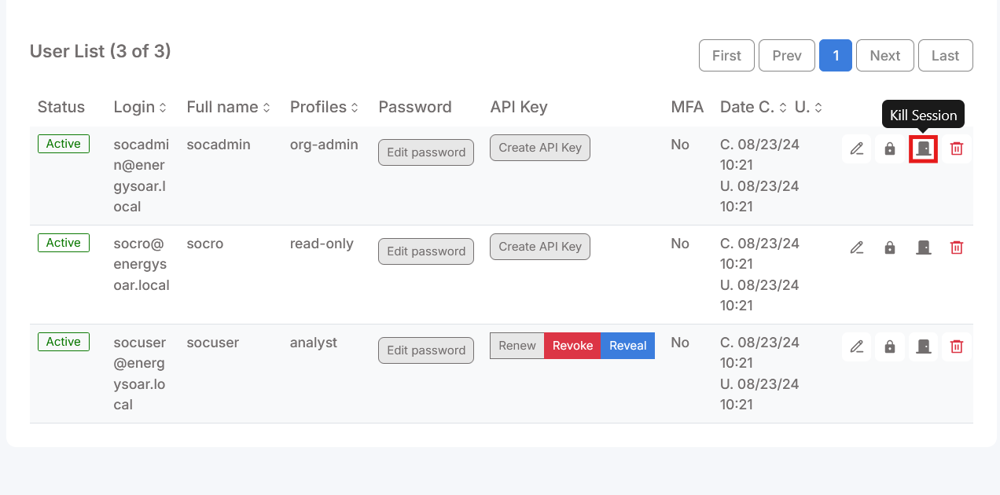

### Reports
#### Create and edit
Go to Reports on top menu

Click Create new report on the left

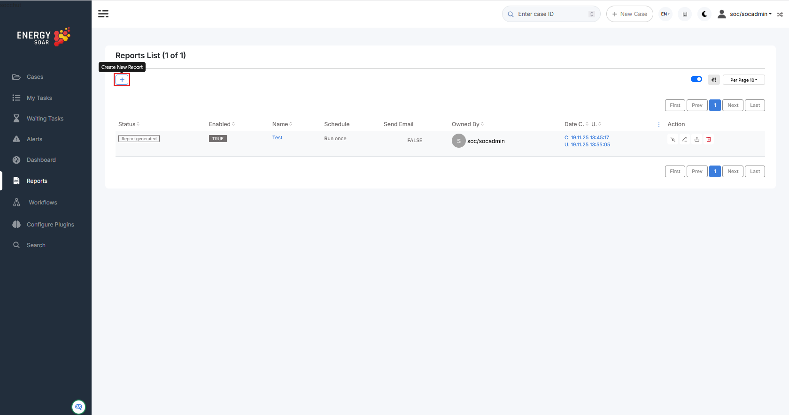

Now you can see New Report view.

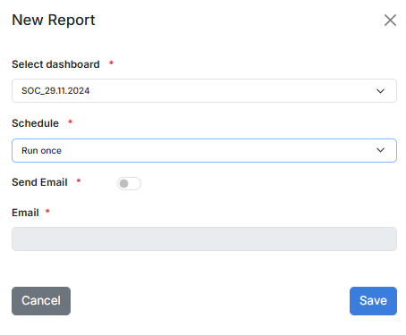

Select dashboard: there you should select exising dashboard. 

Schedule types:
- Run once
- Daily
- Weekly
- Montly
- Cron format (UNIX cron format)

Send Email: select if you would like to recive report on e-mail.

#### List
On reports list you see all created reports.

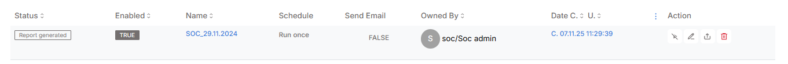

**Reports statuses:**
- Created: Going to create the report
- Generated: Report was generated and you can download or it was sent
- Error: An error occurs. Please check logs

**Actions:**
- Enable/Disable
- Edit
- Download
- Delete

### Cases

#### Observables
Observables are pieces of information added to a case. 

<table style="width: 100%; border: 1px solid #e1e4e5;">
<tbody>
<tr style="height: 33px;">
<td style="height: 33px; text-align: center; border: 1px solid #e1e4e5;" width="154">
autonomous-system
</td>
<td style="height: 33px; text-align: center; border: 1px solid #e1e4e5;" width="154">
fqdn
</td>
<td style="height: 33px; text-align: center; border: 1px solid #e1e4e5;" width="154">
mail
</td>
<td style="height: 33px; text-align: center; border: 1px solid #e1e4e5;" width="154">
registry
</td>
</tr>
<tr style="height: 33px;">
<td style="height: 33px; text-align: center; border: 1px solid #e1e4e5;" width="154">
domain
</td>
<td style="height: 33px; text-align: center; border: 1px solid #e1e4e5;" width="154">
hash
</td>
<td style="height: 33px; text-align: center; border: 1px solid #e1e4e5;" width="154">
mail-subject
</td>
<td style="height: 33px; text-align: center; border: 1px solid #e1e4e5;" width="154">
uri_path
</td>
</tr>
<tr style="height: 33px;">
<td style="height: 33px; text-align: center; border: 1px solid #e1e4e5;" width="154">
file
</td>
<td style="height: 33px; text-align: center; border: 1px solid #e1e4e5;" width="154">
hostname
</td>
<td style="height: 33px; text-align: center; border: 1px solid #e1e4e5;" width="154">
other
</td>
<td style="height: 33px; text-align: center; border: 1px solid #e1e4e5;" width="154">
url
</td>
</tr>
<tr style="height: 33.5px;">
<td style="height: 33.5px; text-align: center; border: 1px solid #e1e4e5;" width="154">
filename
</td>
<td style="height: 33.5px; text-align: center; border: 1px solid #e1e4e5;" width="154">
ip
</td>
<td style="height: 33.5px; text-align: center; border: 1px solid #e1e4e5;" width="154">
regexp
</td>
<td style="height: 33.5px; text-align: center; border: 1px solid #e1e4e5;" width="154">
user-agent
</td>
</tr>
</tbody>
</table>

##### Observable types
You can edit observable types in the administrator panel.

Admin > Observable


##### How to add observables into Case


Perform the following steps to add an observable:

1.	Click Add observable(s) button:


2.	Create new observable(s) window appears:


3.	Select type e.g. ip, domain, url, mail.
If you choose file type, you can upload a file. Zipped archives are supported.


4.	You can add one single observables or many observables at once - one observable per line.
5.	Select appropriate TLP flag.
6.	(Optional) IOC flag indicates observables classified as True Positive. Only IOC-flagged observables are exported to MISP instances.
7.	(Optional) You can also set  “Has been sighted” toggle to mark observables which have been seen.
8.	(Optional) If you click “Ignore for similarity”, you will disable “Observable seen in other cases” list.
9.	Add tags and/or description.
10.	Click Create observable(s).
On Observable List you can check if observables have been seen in other cases:
-	Black eye: Observable seen in other cases,
-	Red eye: Observable seen in other cases and flagged as IOC there.


You can display details and check cases where the observable has been seen:


After uploading file-type observables hashes are automatically calculated:


If you want to download file observable, it will be zipped and password protected:


You can run various analyzers (e.g. VirusTotal, MaxMind_GeoIP) and responders (e.g. block IP, domain, e-mail) against observables.

#### Case Templates

Some cases may share the same structure (`customfields`, `tags`, `tasks`, `description`, ...). Templates are here to automatically add tasks, description, metrics and custom fields while creating a new case. A user can choose to create an empty case or based on a registered template.

##### List case templates

The management of the case templates is accessible through the menu *Organisation > Case Templates* . To manage them your profile must have the permission 'manageCaseTemplate'.

##### Create or upload template

###### Create a case template

In the case templates management page, clic the `New template` button (*Organisation > Case Templates > New Template*). 

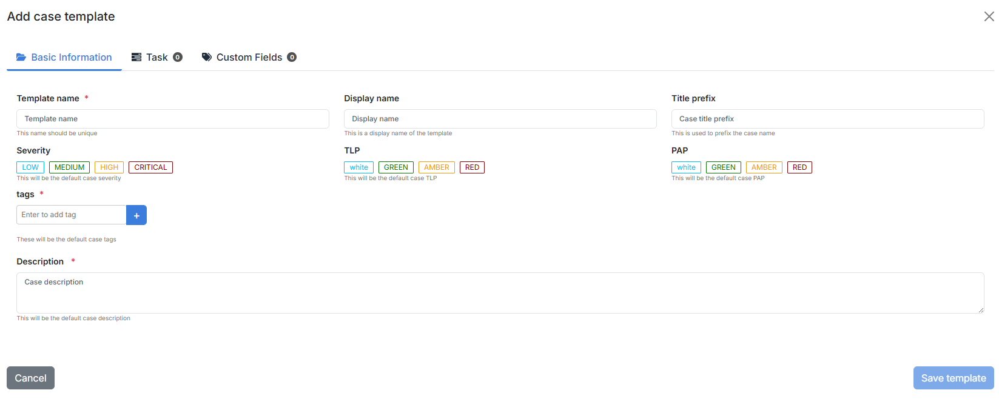

In the case template you can set:

- Title prefix
- Severity
- TLP/PAP
- Tags
- Description
- Tasks
- Customfields 

Two fields are mandatory: 

- Template name (should be unique)
- Description

###### Import a case template

You can also import your case template using a file in JSON format by clicking on the `Import template` button (*Organisation > Case templates > Import template*)

##### Edit a case template

To edit a case template, open the case template list and clic the edit button on the actions column (*Organisation > Case Templates > Edit*).

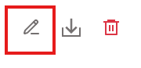

##### Export a case template

To export a case template, open the case template list and clic the export button on the actions column (*Organisation > Case Templates > Export*).

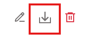

##### Delete a case template

To delete a case template, open the case template list and clic the export button on the actions column (*Organisation > Case Templates > Export*).

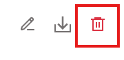

##### Case Template list

- Suspicious User Activity
- User authentication from multiple devices
- Data Theft
- Mass deleting files or folders
- Malware
- Admin creation
- Unauthorized Access
- Denial of Service (DoS)
- Short-lived account
- Suspicious VPN connection
- Suspicious e-mail
- Suspicious Network Activity
- IRM-5-MaliciousNetworkBehaviour
- Vulnerability


### Organization

Organization allows using a single instance of EnergySOAR with separation among clients.

Multi-tenancy in EnergySOAR enables a single instance of the platform to support multiple organizations, each operating independently.

Every organization has its own set of users, roles, cases, alerts, and analyzers, ensuring that data and workflows remain isolated.
This separation allows organizations to collaborate securely within the same system without risking unauthorized access to other organizations’ information.
Administrators can centrally manage the instance while maintaining strict boundaries between tenants, simplifying both operational oversight and compliance with data privacy requirements.

A user in EnergySOAR can belong to multiple organizations, allowing them to access and contribute to different tenants within the same instance. 
Users can easily switch between organizations without needing to log out, with their permissions and data access automatically adjusted for each tenant. 

This flexibility enables administrators and analysts to collaborate across multiple organizations while maintaining strict separation of cases, alerts, and other sensitive information.

#### User

In EnergySOAR, a user is a member of one or more organisations. One user has a profile **for each** organisation and can have different profiles for different organisations. For example:

- “*analyst*” in “*organisationA*”;
- and “*admin*” in “*organisationB*”;
- and “*read-only*” in “*organisationC*”.

#### Organization and Case sharing

EnergySOAR comes with a default organisation named "admin" and is dedicated to users with administrator permissions of EnergySOAR instance. This organisation is very specific so that it can manage global objects and cannot contain cases or any other related elements. 

By default, organisations can’t see each other, and can't share with any. To do so, an organisation must be "linked" with another one.  Only super administrators or users with **manageOrganisation** permissions can give the ability of a organisation to see an other one. This ability named “*link*” is unidirectional. 

To share a case with another organisation, a user must be able to see it: its organisation must be "linked" with the targeted organisation. 

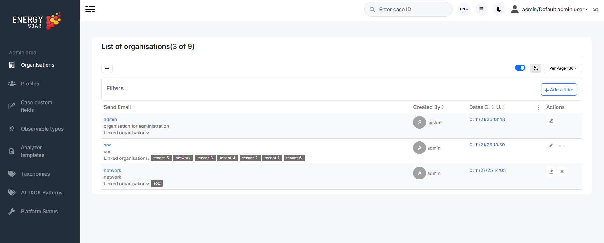

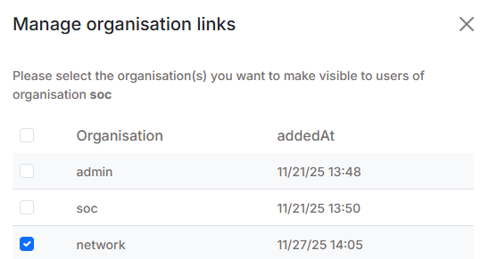

#####  Share and effective permissions

When a user creates a case, the case is linked to the user’s organisation with the profile “org-admin”. It means that there is no restriction, the effective permissions are the permissions the user has in his organisation.

If he decides to share that case with another organisation, he must choose the profile applied on that share.

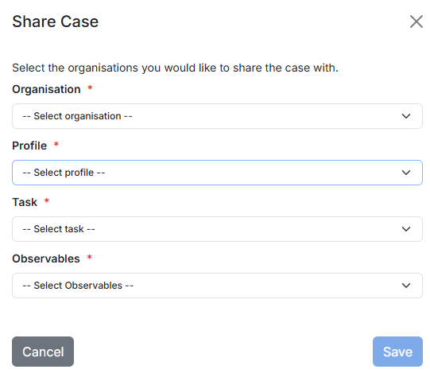

To exerce a action on a case, the related permission must be present in the user profile and in the case share.

When you share a case, you can share its tasks or observables but it is not mandatory. Tasks (and observables) can be unitary shared.

They can be shared only with organisations for which case is already shared. A case can be shared only once for a given organisation. Thus a case an its tasks/observables are shared with the same permissions for the same organisation.


#### Custom Tags

`custom tags` are `tags` manually created (out of libraries). 

You must have the permission `manageTag` on your profile to manage custom tags.

##### List custom tags

You can find the list of your `custom tags` in *Organization > Custom tags*.

The list contains the following information, for each `tag`:

- Number of `cases` tagged
- Number of `alerts` tagged
- Number of `observables` tagged
- Number of `case templates` containing the tag


##### Modify a custom-tag border colour

You can modify your custom tags border colours. 

In the `custom tags` list (*Organization > Custom tags*), in the *Colour* column, clic on the square or colour code value to modify it. This will apply to all `cases`, `alerts` and `observables` that contains the `tag`.

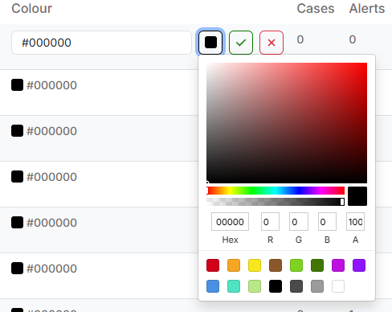

##### Delete a custom tag

You can also delete a custom tag. 

In the `custom tags` list (*Organization > Custom tags*), in the *Actions* column, clic on the delete button


### Workflows
SOC analysts have to handle many repetitive tasks. With Energy SOAR you can build workflows to automatically execute all relevant actions.

Workflows helps you to interconnect different apps with an API with each other to share and manipulate its data without a single line of code. It is an easy to use, user-friendly and highly customizable module, which uses an intuitive user interface for you to design your unique scenarios very fast. 
A workflow is a collection of nodes connected together to automate a process.
A workflow can be started manually (with the Start node) or by Trigger nodes. When a workflow is started, it executes all the active and connected nodes. The workflow execution ends when all the nodes have processed their data. You can view your workflow executions in the Execution log, which can be helpful for debugging.


**Activating a workflow**
Workflows that start with a Trigger node or a Webhook node need to be activated in order to be executed. This is done via the Active toggle in the Workflow UI.
Active workflows enable the Trigger and Webhook nodes to receive data whenever a condition is met (e.g., Monday at 10:00, an update in a Trello board) and in turn trigger the workflow execution.
All the newly created workflows are deactivated by default.

**Sharing a workflow**

Workflows are saved in JSON format. You can export your workflows as JSON files or import JSON files into your system.
You can export a workflow as a JSON file in two ways:
*	Download: Click the Download button under the Workflow menu in the sidebar. This will download the workflow as a JSON file.
*	Copy-Paste: Select all the workflow nodes in the Workflow UI, copy them (Ctrl + c), then paste them (Ctrl + v) in your desired file.
You can import JSON files as workflows in two ways:
*	Import: Click Import from File or Import from URL under the Workflow menu in the sidebar and select the JSON file or paste the link to a workflow.
*	Copy-Paste: Copy the JSON workflow to the clipboard (Ctrl + c) and paste it (Ctrl + v) into the Workflow UI.

**Workflow settings**

On each workflow, it is possible to set some custom settings and overwrite some of the global default settings from the Workflow > Settings menu.


 
The following settings are available:
*	Error Workflow: Select a workflow to trigger if the current workflow fails. 
*	Timezone: Sets the timezone to be used in the workflow. The Timezone setting is particularly important for the Cron Trigger node.
*	Save Data Error Execution: If the execution data of the workflow should be saved when the workflow fails.
*	Save Data Success Execution: If the execution data of the workflow should be saved when the workflow succeeds.
*	Save Manual Executions: If executions started from the Workflow UI should be saved.
*	Save Execution Progress: If the execution data of each node should be saved. If set to "Yes", the workflow resumes from where it stopped in case of an error. However, this might increase latency.
*	Timeout Workflow: Toggle to enable setting a duration after which the current workflow execution should be cancelled.
*	Timeout After: Only available when Timeout Workflow is enabled. Set the time in hours, minutes, and seconds after which the workflow should timeout. 

**Failed workflows**

If your workflow execution fails, you can retry the execution. To retry a failed workflow:
1.	Open the Executions list from the sidebar.
2.	For the workflow execution you want to retry, click on the refresh icon under the Status column.
3.	Select either of the following options to retry the execution: 
*	Retry with currently saved workflow: Once you make changes to your workflow, you can select this option to execute the workflow with the previous execution data.
*	Retry with original workflow: If you want to retry the execution without making changes to your workflow, you can select this option to retry the execution with the previous execution data.

You can also use the Error Trigger node, which triggers a workflow when another workflow has an error. Once a workflow fails, this node gets details about the failed workflow and the errors.
<!-- 
#### Crate your first workflow

##### Automate Incident Reporting with Typeform
Let’s create your first workflow in Energy SOAR. The workflow will create a new alert and promote it to a case whenever a user submits a high severity incident.

**Prerequisites**

You'll need to obtain the credentials for the Typeform Trigger node.
1.	Create a Typeform account: https://www.typeform.com/
2.	Open the Typeform dashboard: https://admin.typeform.com/
3.	Click on your avatar on the top right and select 'Settings'.
4.	Click on Personal tokens under the Profile section in the sidebar.
5.	Click on the Generate a new token button.
6.	Enter a name in the Token name field.
7.	Click on the Generate token button.
8.	Click on the Copy button to copy the access token.
9.	In Energy SOAR choose Workflows > Credentials > New > Typeform API.
10.	Enter a name for your credentials in the Credentials Name field.
11.	Paste the access token in the Access Token field.
12.	Click the Create button to save your credentials in Energy SOAR.

You will also need to create a form in Typeform to collect incident reports with the following questions:
*	What is your name? (optional) (Short Text)
*	What is your email address? (optional) (Email)
*	What is incident’s category? (Multiple Choice)

  
 
*	Severity (Multiple Choice)


*	Description (Long Text)

**Building the Workflow**

This workflow would use the following nodes:
*	Typeform Trigger - Start the workflow when a form receives a report
*	Set - Set the workflow data
*	FunctionItem - Calculate severity and alert reference
*	Energy SOAR Base - Create alert and case
*	IF - Conditional logic to decide the flow of the workflow
*	NoOp - Do nothing (optional)

The final workflow should look like the following image:

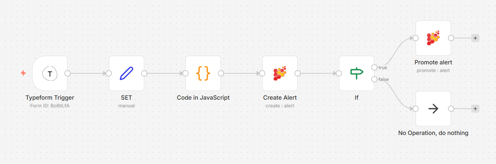

1.	Typeform Trigger node

We'll use the Typeform Trigger node for starting the workflow. Add a Typeform Trigger node by clicking on the + button on the top right of the Workflow UI. Click on the Typeform Trigger node under the section marked Trigger.

Double click on the node to enter the Node Editor. Select Credentials from the Typeform API dropdown list.

Select the form that you created from the Form dropdown list. We'll let the other fields stay as they are.

Now save your workflow so that the webhook in the Typeform Trigger node can be activated. Since you’ll be using the test webhooks while building the workflow, the node only stays active for 120 seconds after you click the Execute Node button.

After clicking on the Execute Node button, submit a response to your form in Typeform.


 

2.	Set node

We'll use the Set node to ensure that only the data that we set in this node gets passed on to the next nodes in the workflow.

Add the Set node by clicking on the + button and selecting the Set node. Click on Add Value and select String from the dropdown list. Enter title in the Name field. Since the Value (title) would be a dynamic piece of information, click on the gears icon next to the field, and select Add Expression.

This will open up the Variable Selector. From the left panel, select the following variable:
Nodes > Typeform Trigger > Output Data > JSON > What is incident’s category?
Also add Incident Report prefix, so the expression would look like this:
Incident Report - {{$node["Typeform Trigger"].json["What is incident's category?"]}}

Close the Edit Expression window. Click on Add Value and select String from the dropdown list. Enter description in the Name field. Since the Value (description) would be a dynamic piece of information, click on the gears icon next to the field, and select Add Expression.
This will open up the Variable Selector. From the left panel, select the following variables:
Nodes > Typeform Trigger > Output Data > JSON > What is your name?
Nodes > Typeform Trigger > Output Data > JSON > What is your email address?
Nodes > Typeform Trigger > Output Data > JSON > Description?

Also add Name, E-mail, Details prefixes. Full expression:
Name: `{{$node["Typeform Trigger"].json["First up, what's your full name"]}}`

E-mail: `{{$node["Typeform Trigger"].json["And your email address?"]}}`

Details: `{{$node["Typeform Trigger"].json["Could you tell us what happened exactly?"]}}`

Close the Edit Expression window. Click on Add Value and select Number from the dropdown list. Enter severity in the Name field. Since the Value (severity) would be a dynamic piece of information, click on the gears icon next to the field, and select Add Expression.
This will open up the Variable Selector. Delete the 0 in the Expression field on the right. From the left panel, select the following variable:
Nodes > Typeform Trigger > Output Data > JSON > Severity
Toggle Keep Only Set to true. We set this option to true to ensure that only the data that we have set in this node get passed on to the next nodes in the workflow. Click on the Execute Node button on the top right to set the data for the workflow.


 
3.	FunctionItem node

To create Energy SOAR alert in workflow we have to provide SourceRef number. We’ll use the FunctionItem node to generate that random number.
Add the FunctionItem node by clicking on the + button and selecting the FunctionItem node.
Clear JavaScript Code window and insert the following code:

```
function getRandomInt(max) {
  return Math.floor(Math.random() * max);
}
item.number= getRandomInt(20000000);
item.number=item.number.toString(16);
item.severity=parseInt(item.severity);
return item;
```

We use parseInt function to convert string severity value into an integer.

4.	Create alert node
Add Energy SOAR Base node by clicking on the + button and selecting the Energy SOAR Base node. Double click on the node and click on Energy SOAR Base name to change it to Create alert.

Since the Title would be a dynamic piece of information, click on the gears icon next to the field, and select Add Expression.

This will open up the Variable Selector. From the left panel, select the following variable:
Nodes > Set > Output Data > JSON > title

Close the Edit Expression window. In Description field add expression:
Nodes > Set > Output Data > JSON > description

Close the Edit Expression window. In Severity field add expression:
Nodes > FunctionItem > Output Data > JSON > severity

Close the Edit Expression window. In SourceRef field add expression:
Nodes > FunctionItem > Output Data > JSON > number

Click on the Execute Node button on the top right to create alert.

5.	IF node
Add the IF node by clicking on the + button and selecting the IF node. This is a conditional logic node that allows us to alter the flow of the workflow depending on the data that we get from the previous node(s).
Double click on the node, click on the Add Condition button and select Number from the menu. Since the Value 1 (severity) would be a dynamic piece of information, click on the gears icon next to the field, and select Add Expression.
This will open up the Variable Selector. Delete the 0 in the Expression field on the right. From the left panel, select the following variable:
Nodes > Create alert > Output Data > JSON > severity
For the Operation field, we'll set it to 'Larger'. For Value 2, enter 2. This will ensure that the IF node returns true only if the severity is higher than 2 (above medium level). Feel free to change this to some other value. Click on the Execute Node button on the top right to check if the severity is larger than 2 or not.

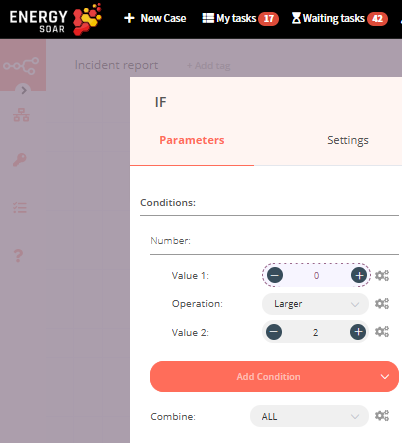


6.	Promote alert node

Add Energy SOAR Base node by clicking on the + button and selecting the Energy SOAR node. Double click on the node and click on Energy SOAR name to change it to Promote alert.

Select ‘Promote’ from the Operation dropdown list.
In Alert ID field add expression:
Nodes > Create alert > Output Data > JSON > _id

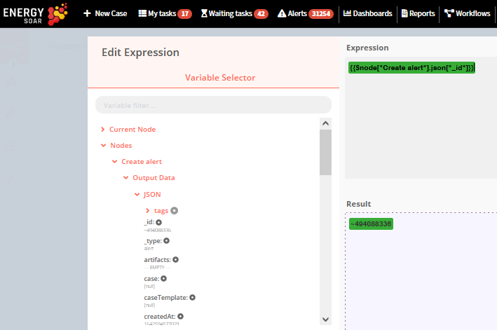


7.	NoOp node
If the score is smaller than 3, we don't want the workflow to do anything. We'll use the NoOp node for that. Adding this node here is optional, as the absence of this node won't make a difference to the functioning of the workflow. Add the NoOp node by clicking on the + button and selecting the NoOp node. Connect this node with the false output of the IF node.
To test the workflow, click on the Execute Workflow button at the bottom of the Workflow UI.
Don't forget to save the workflow and then click on the Activate toggle on the top right of the screen to set it to true and activate the workflow. 
Green checkmarks indicate successful workflow execution:

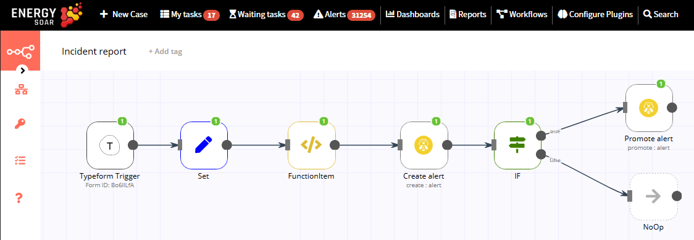

Congratulations on creating you first workflow with Energy SOAR. -->


#### Connection

A connection establishes a link between nodes to route data through the workflow. A connection between two nodes passes data from one node's output to another node's input. Each node can have one or multiple connections.

To create a connection between two nodes, click on the grey dot on the right side of the node and slide the arrow to the grey rectangle on the left side of the following node.

##### Example

An IF node has two connections to different nodes: one for when the statement is true and one for when the statement is false.


#### Workflows List

This section includes the operations for creating and editing workflows.

* **New**: Create a new workflow
* **Open**: Open the list of saved workflows
* **Save**: Save changes to the current workflow
* **Save As**: Save the current workflow under a new name
* **Rename**: Rename the current workflow
* **Delete**: Delete the current workflow
* **Download**: Download the current workflow as a JSON file
* **Import from URL**: Import a workflow from a URL
* **Import from File**: Import a workflow from a local file
* **Settings**: View and change the settings of the current workflow

#### Credentials

This section includes the operations for creating credentials.

Credentials are private pieces of information issued by apps/services to authenticate you as a user and allow you to connect and share information between the app/service and the n8n node.

* **New**: Create new credentials
* **Open**: Open the list of saved credentials

#### Executions

This section includes information about your workflow executions, each completed run of a workflow.

You can enabling logging of your failed, successful, and/or manually selected workflows using the Workflow > Settings page.

#### Node

A node is an entry point for retrieving data, a function to process data, or an exit for sending data. The data process performed by nodes can include filtering, recomposing, and changing data.

There may be one or several nodes for your API, service, or app. By connecting multiple nodes, you can create simple and complex workflows. When you add a node to the Editor UI, the node is automatically activated and requires you to configure it (by adding credentials, selecting operations, writing expressions, etc.).

There are three types of nodes:

* Core Nodes
* Regular Nodes
* Trigger Nodes


Nodes are the building blocks of workflows. They are an entry point for retrieving data, a function to process data, or an exit for sending data. The data process includes filtering, recomposing, and changing data. Connect multiple nodes to create complex workflows.

For a complete list of available integrations, including:

* {doc}`Actions (App) nodes <../08-0-0-Workflow/integrations/builtin/app-nodes/index>` - 270+ integrations with external services like Slack, Google Drive, GitHub, and more
* {doc}`Core nodes <../08-0-0-Workflow/integrations/builtin/core-nodes/index>` - Essential workflow building blocks for logic, data transformation, HTTP requests, and scheduling
* {doc}`Trigger nodes <../08-0-0-Workflow/integrations/builtin/trigger-nodes/index>` - 80+ event-based workflow starters that listen for changes in external services
* {doc}`Credentials <../08-0-0-Workflow/integrations/builtin/credentials/index>` - 300+ authentication configurations for all integrations
* {doc}`Cluster nodes <../08-0-0-Workflow/integrations/builtin/cluster-nodes/index>` - Advanced AI and LangChain integrations for building complex AI workflows
* {doc}`Community nodes <../08-0-0-Workflow/integrations/community-nodes/usage>` - Nodes contributed by the community
* {doc}`Create your own node <../08-0-0-Workflow/integrations/creating-nodes/overview>` - Build a custom node for your specific needs

```{toctree}
:maxdepth: 1
:caption: Built-in App Nodes

../08-0-0-Workflow/integrations/builtin/app-nodes/index
```

```{toctree}
:maxdepth: 1
:caption: Built-in Core Nodes

../08-0-0-Workflow/integrations/builtin/core-nodes/index
```

```{toctree}
:maxdepth: 1
:caption: Built-in Trigger Nodes

../08-0-0-Workflow/integrations/builtin/trigger-nodes/index
```

```{toctree}
:maxdepth: 1
:caption: Community Nodes

../08-0-0-Workflow/integrations/community-nodes/index
```

```{toctree}
:maxdepth: 1
:caption: Built-in Credentials

../08-0-0-Workflow/integrations/builtin/credentials/index
```

```{toctree}
:maxdepth: 1
:caption: Built-in Cluster Nodes

../08-0-0-Workflow/integrations/builtin/cluster-nodes/index
```

```{toctree}
:maxdepth: 1
:caption: Create Your Own Node

../08-0-0-Workflow/integrations/creating-nodes/overview
```

```{toctree}
:maxdepth: 1
:caption: Rate Limits

../08-0-0-Workflow/integrations/builtin/rate-limits
```

```{toctree}
:maxdepth: 1
:caption: Advanced AI

../08-0-0-Workflow/advanced-ai/index
```

```{toctree}
:maxdepth: 1
:caption: Glossary

../08-0-0-Workflow/glossary
```

##### Core nodes

Core nodes are functions or services that can be used to control how workflows are run or to provide generic API support.

Use the Start node when you want to manually trigger the workflow with the `Execute Workflow` button at the bottom of the Editor UI. This way of starting the workflow is useful when creating and testing new workflows.

If an application you need does not have a dedicated Node yet, you can access the data by using the HTTP Request node or the Webhook node. You can also read about creating nodes and make a node for your desired application.


##### Regular nodes

Regular nodes perform an action, like fetching data or creating an entry in a calendar. Regular nodes are named for the application they represent and are listed under Regular Nodes in the Editor UI.


###### Example

A Google Sheets node can be used to retrieve or write data to a Google Sheet.


##### Trigger nodes

Trigger nodes start workflows and supply the initial data.


Trigger nodes can be app or core nodes.

* **Core Trigger nodes** start the workflow at a specific time, at a time interval, or on a webhook call. For example, to get all users from a Postgres database every 10 minutes, use the Interval Trigger node with the Postgres node.

* **App Trigger nodes** start the workflow when an event happens in an app. App Trigger nodes are named like the application they represent followed by "Trigger" and are listed under Trigger Nodes in the Editor. For example, a Telegram trigger node can be used to trigger a workflow when a message is sent in a Telegram chat.


##### Node settings

Nodes come with global **operations** and **settings**, as well as app-specific **parameters** that can be configured.

###### Operations

The node operations are illustrated with icons that appear on top of the node when you hover on it:
* **Delete**: Remove the selected node from the workflow
* **Pause**: Deactivate the selected node
* **Copy**: Duplicate the selected node
* **Play**: Run the selected node


To access the node parameters and settings, double-click on the node.

###### Parameters

The node parameters allow you to define the operations the node should perform. Find the available parameters of each node in the node reference.

###### Settings

The node settings allow you to configure the look and execution of the node. The following options are available:

* **Notes**: Optional note to save with the node
* **Display note in flow**: If active, the note above will be displayed in the workflow as a subtitle
* **Node Color**: The color of the node in the workflow
* **Always Output Data**: If active, the node will return an empty item even if the node returns no data during an initial execution. Be careful setting this on IF nodes, as it could cause an infinite loop.
* **Execute Once**: If active, the node executes only once, with data from the first item it receives.
* **Retry On Fail**: If active, the node tries to execute a failed attempt multiple times until it succeeds
* **Continue On Fail**: If active, the workflow continues even if the execution of the node fails. When this happens, the node passes along input data from previous nodes, so the workflow should account for unexpected output data.


If a node is not correctly configured or is missing some required information, a **warning sign** is displayed on the top right corner of the node. To see what parameters are incorrect, double-click on the node and have a look at fields marked with red and the error message displayed in the respective warning symbol.


