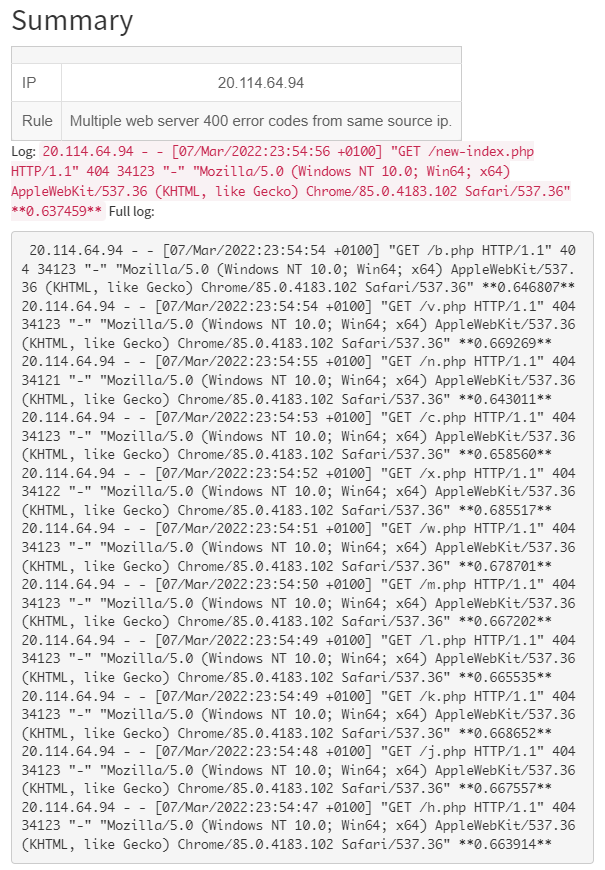

Integrations
============


.. toctree::
    :maxdepth: 1

    Responders
    Analyzers

Energy Logserver SIEM
---------------------

This integration send alerts from Energy Logserver SIEM to Energy SOAR.

Create API key
^^^^^^^^^^^^^^^

Create new (non-admin) user and generate API key.

.. image:: /media/01-00-02-api_create.png

Click Reveal

.. image:: /media/01-00-01-api_methods.png

Copy the API key

.. image:: /media/01-00-00-api_key.png

Edit Alert
^^^^^^^^^^

Add configuration in the Alert service config.

.. code-block:: bash

   # vi /opt/alert/config.yaml

.. code-block:: yaml

   hive_connection:
     hive_host: https://<Energy_SOAR_IP>/base
     hive_apikey: <api_key>

Restart the Alert service

.. code-block:: bash

   # systemctl restart alert

Alert rule configuration
^^^^^^^^^^^^^^^^^^^^^^^^

Configure details in the alert rule configuration

.. code-block:: yaml

   alert: hivealerter
   hive_alert_config_type: classic
   hive_alert_config:
     type: "AUDIT"
     source: "SIEM"
     severity: 2
     tags: ["ELS","audit"]
     tlp: 3
     status: "New"
     follow: True
   hive_observable_data_mapping:
    - ip: "{match[src_ip]}"
      message: "Source IP address"
      tags: ["src: SIEM"]
    - domain: "{match[username]}"
      message: "Audit username"
      tags: ["src: SIEM"]

Custom message
^^^^^^^^^^^^^^

By default Energy Logserver SIEM send a json with all alert fields. You can customize your message using markdown.

For example:

.. code-block:: none

   alert_text: "## Summary\r\n
   \r\n\r\n
   |  |  |\r\n
   |---|---|\r\n
   | IP | {} |\r\n
   | Rule | {} |\r\n
   \r\n\r\n
   Log: `{}`\r\n
   Full log: \r\n
   ```\r\n
   {}\r\n
   ```\r\n
   "
   alert_text_args:
     - data.srcip
     - rule.description
     - full_log
     - previous_output

Preview:



Microsoft Exchange
------------------

Installation
^^^^^^^^^^^^^^^

Download the Exchange integration.

.. code-block:: bash

   # curl -u'license user:license pwd' \
   -O https://repo.energysoar.com/add-ons/synapse.tar.gz

Unpack and install the dependencies.

.. code-block:: bash

   # tar -zxvf synapse.tar.gz -C /opt
   # dnf install -y python3-devel gcc
   # /usr/bin/python3 -m pip install -r /opt/synapse/requirements.txt

Install the system service.

.. code-block:: bash

   # cp "/opt/synapse/synapse@.service" /usr/lib/systemd/system/

Info: The service allows you to run multiple instances.
Create a synapse user.

.. code-block:: bash

   # adduser -r -s /bin/nologin -d /opt/synapse --system synapse

Change permissions.

.. code-block:: bash

   # chown -R synapse: /opt/synapse

Instance configuration
^^^^^^^^^^^^^^^

.. code-block:: bash

   # mv /opt/synapse/conf/synapse.conf \
   /opt/synapse/conf/synapse.conf.example

   # cp /opt/synapse/conf/synapse.conf.example \
   /opt/synapse/conf/exchange.conf

Enter the file ``/opt/synapse/conf/exchange.conf`` and make the following changes.

Set the API key and user in TheHive section.

.. code-block:: none

   user:
   api_key:

To do this, create a new technical account. Log in as an admin or soc-admin to the Energy SOAR system.
In the case of an admin, click on the organization in which you want to create the user.
Then create a new local user.

.. image:: /media/create-new-user.png


.. code-block:: none

   Login: synapse@energysoar.local
   Full name: Synapse
   Profile: analyst

If the user already exists, you can create an API key by clicking on the following button.

.. image:: /media/01-00-02-api_create.png

Then to copy the key, you need to open it by clicking the Reveal button.

.. image:: /media/api-reveal.png

In the EWS section, provide data for the technical account from which we will read emails.

.. code-block:: none

   username:
   password:
   auth_type:NTLM
   smtp_address:
   folder_name:Inbox

Inbox is the main folder to which all emails are usually sent. If the integration is to read emails from another catalog, you should specify it here.
In the [Instance] section, change the name from synapse to exchange.

Start the instance

.. code-block:: bash

   # systemctl enable --now synapse@exchange
