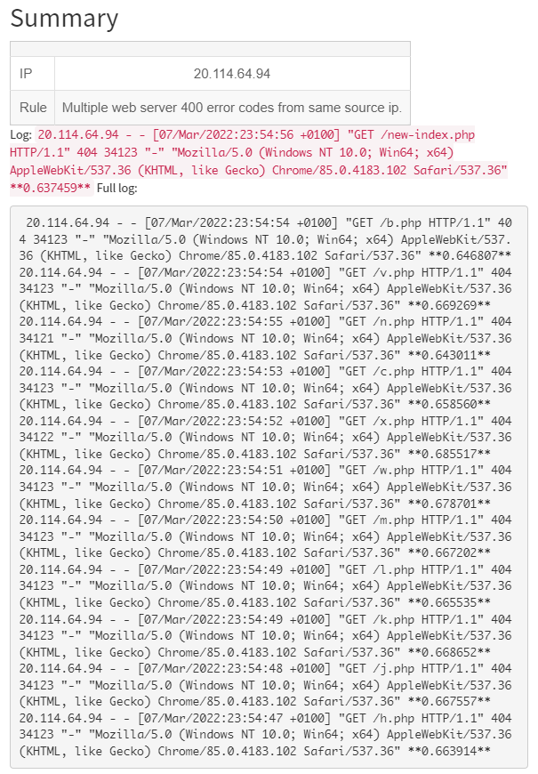

Integrations
============

The platform provides many integrations that help automate security work and exchange data smoothly between systems used in an organization's security and IT environment. These integrations are grouped into three main types, and each type has a different role in workflow automation and incident response.

Workflow Nodes — 500+
---------------------

Workflow Nodes are building blocks used to create and run automated workflows. Each node is a specific integration, action, or data-processing step that can be used in an automated playbook.

Workflow nodes enable, for example:

- Communication with external systems and APIs
- Integration with security and IT platforms
- Data changes and processing
- Logical operations and conditional execution
- Running multi-step security processes

These nodes let organizations build advanced automation flows that simplify SOC work and connect many tools in one coordinated workflow.

See the full Workflow Nodes list: `Workflow Nodes <../05-0-0-User_guide/05-0-0-User_guide.html#node>`_.

Analyzers — 130+
----------------

Analyzers are used to add context to and analyze security data. They automatically collect extra details about artifacts such as IP addresses, domains, files, URLs, or email addresses.

Typical analyzer use cases include:

- IOC reputation checks
- File and malware analysis
- Adding threat intelligence context
- Collecting context from external intelligence sources

By automatically adding context to artifacts, analyzers speed up investigations and help analysts make faster, better decisions.

See the full Analyzers list: :doc:`Analyzers <Analyzers>`.

Responders — 50+
----------------

Responders run response actions in external systems and security platforms. They are used when a specific action must be taken based on analysis results or a defined workflow.

Examples of responder actions include:

- Blocking IP addresses or domains
- Isolating hosts or user accounts
- Updating security platform rules
- Creating tickets in incident management systems
- Sending alerts or notifications

Responders support automated or semi-automated incident response, helping reduce response time and limit the impact of security threats.

See the full Responders list: :doc:`Responders <Responders>`.

Summary
-------

The platform currently provides:

- **500+ Workflow Nodes**
- **130+ Analyzers**
- **50+ Responders**

This gives you **more than 680 available integrations** for automation, data context, and response in one security automation environment.


.. toctree::
    :maxdepth: 1

    Responders
    Analyzers
    how-to-write-analyzer.md
    how-to-write-automation-node.rst

Energy Logserver SIEM
---------------------

This integration send alerts from Energy Logserver SIEM to Energy SOAR.

Create API key
^^^^^^^^^^^^^^^

Create new (non-admin) user and generate API key.

.. image:: /media/01-00-02-api_create.png

Click Reveal

.. image:: /media/01-00-01-api_methods.png

Copy the API key

.. image:: /media/01-00-00-api_key.png

Edit Alert
^^^^^^^^^^

On Energy Logserver add configuration in the Alert service config.

.. code-block:: bash

   # vi /opt/alert/config.yaml

.. code-block:: yaml

   hive_connection:
      hive_host: https://<Energy_SOAR_IP>/base
      hive_apikey: <api_key>

Restart the Alert service

.. code-block:: bash

   # systemctl restart alert

Alert rule configuration
^^^^^^^^^^^^^^^^^^^^^^^^

Configure details in the alert rule configuration

.. code-block:: yaml

   alert: hivealerter
   hive_alert_config_type: classic
   hive_alert_config:
     type: "AUDIT"
     source: "SIEM"
     severity: 2
     tags: ["ELS","audit"]
     tlp: 3
     status: "New"
     follow: True
   hive_observable_data_mapping:
    - ip: "{match[src_ip]}"
      message: "Source IP address"
      tags: ["src: SIEM"]
    - domain: "{match[username]}"
      message: "Audit username"
      tags: ["src: SIEM"]

Custom message
^^^^^^^^^^^^^^

By default Energy Logserver SIEM send a json with all alert fields. You can customize your message using markdown.

For example:

.. code-block:: none

   alert_text: "## Summary\r\n
   \r\n\r\n
   |  |  |\r\n
   |---|---|\r\n
   | IP | {} |\r\n
   | Rule | {} |\r\n
   \r\n\r\n
   Log: `{}`\r\n
   Full log: \r\n
   ```\r\n
   {}\r\n
   ```\r\n
   "
   alert_text_args:
     - data.srcip
     - rule.description
     - full_log
     - previous_output

Preview:



Microsoft Exchange
------------------

Installation
^^^^^^^^^^^^^^^

Download the Exchange integration.

.. code-block:: bash

   # curl -u'license user:license pwd' \
   -O https://repo.energysoar.com/add-ons/synapse.tar.gz

Unpack and install the dependencies.

.. code-block:: bash

   # tar -zxvf synapse.tar.gz -C /opt
   # dnf install -y python3-devel gcc
   # /usr/bin/python3 -m pip install -r /opt/synapse/requirements.txt

Install the system service.

.. code-block:: bash

   # cp "/opt/synapse/synapse@.service" /usr/lib/systemd/system/

Info: The service allows you to run multiple instances.
Create a synapse user.

.. code-block:: bash

   # adduser -r -s /bin/nologin -d /opt/synapse --system synapse

Change permissions.

.. code-block:: bash

   # chown -R synapse: /opt/synapse

Instance configuration
^^^^^^^^^^^^^^^

.. code-block:: bash

   # mv /opt/synapse/conf/synapse.conf \
   /opt/synapse/conf/synapse.conf.example

   # cp /opt/synapse/conf/synapse.conf.example \
   /opt/synapse/conf/exchange.conf

Enter the file ``/opt/synapse/conf/exchange.conf`` and make the following changes.

Set the API key and user in Energy SOAR Base section.

.. code-block:: none

   user:
   api_key:

To do this, create a new technical account. Log in as an admin or soc-admin to the Energy SOAR system.
In the case of an admin, click on the organization in which you want to create the user.
Then create a new local user.

.. image:: /media/create-new-user.png


.. code-block:: none

   Login: synapse@energysoar.local
   Full name: Synapse
   Profile: analyst

If the user already exists, you can create an API key by clicking on the following button.

.. image:: /media/01-00-02-api_create.png

Then to copy the key, you need to open it by clicking the Reveal button.

.. image:: /media/api-reveal.png

In the EWS section, provide data for the technical account from which we will read emails.

.. code-block:: none

   username:
   password:
   auth_type:NTLM
   smtp_address:
   folder_name:Inbox

Inbox is the main folder to which all emails are usually sent. If the integration is to read emails from another catalog, you should specify it here.
In the [Instance] section, change the name from synapse to exchange.

Start the instance

.. code-block:: bash

   # systemctl enable --now synapse@exchange
